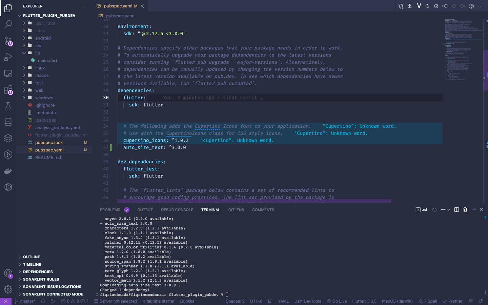
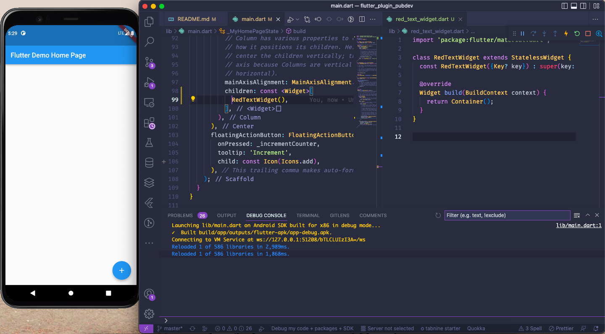
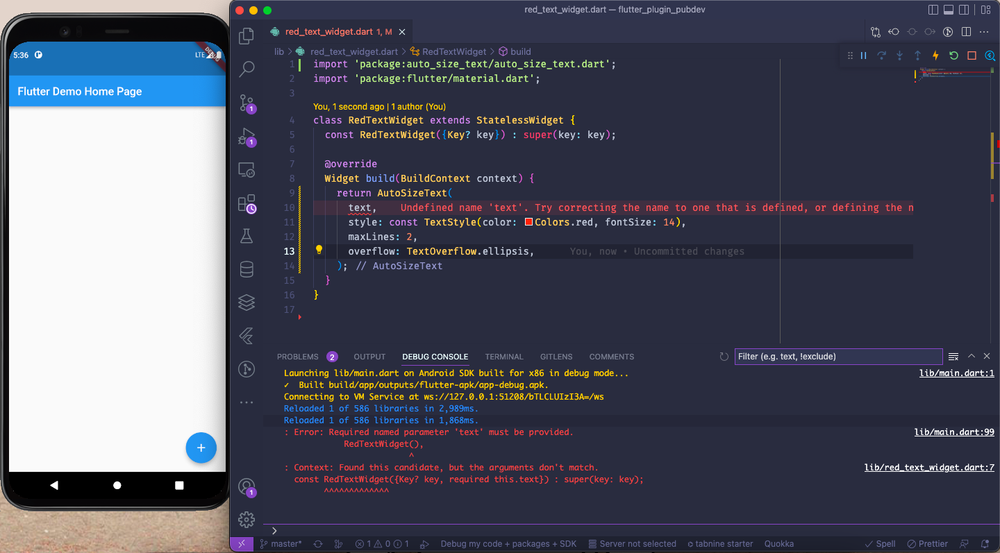
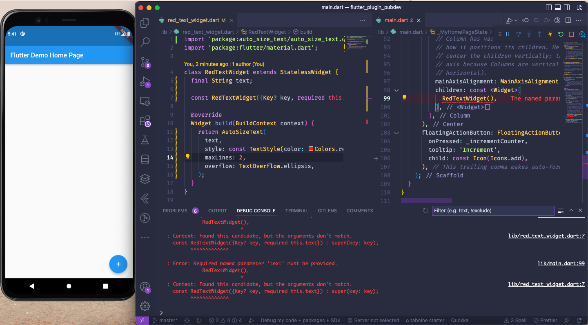
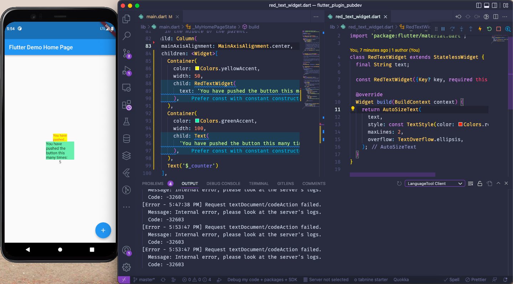

# flutter_plugin_pubdev

A new Flutter project.

## Getting Started

## Screenshot Langkah 2

### Penjelasan:

Ketika kita menjalankan perintah <code>flutter pub add auto_size_text</code> kita akan menambahkan plugin auto_size_text dan secara otomatis melakukan pub get untuk mengimplementasikan plugin ke projek kita

## Screenshot Langkah 3

## Screenshot Langkah 4

### Penjelasan:

Terjadi eror karena kita belum menginisiasi tipe data yang akan kita gunakan pada variabel <code>text</code>

## Screenshot Langkah 5

### Penjelasan:

Setelah kita inisiasi nilai maka akan ada eror baru di <code>main.dart</code> dikarenakan kita belum mengisi atau memberikan nilai String <code>text</code>

## Screenshot Langkah 6

### Penjelasan:

Perbedaannya yang satu memanggil class <code>RedTextWidget</code> dimana fungsinya telah kita atur sendiri sebelumnya sedangkan satunya memanggil class <code>Text</code> dari bawaan flutter sehingga menampilkan hasil yang berbeda

## Tugas Parameter

| Parameter | Deskripsi |
| ------------- | ------------- |
| <code>key</code>*  | Mengontrol bagaimana satu widget menggantikan widget lain di pohon.  |
| <code>textKey</code> | Setel kunci untuk <code>Text</code> widget yang dihasilkan  |
| <code>style</code>* | Jika bukan nol, gaya yang digunakan untuk teks ini |
| <code>minFontSize</code>  | Batasan ukuran teks minimum yang akan digunakan saat mengubah ukuran teks secara otomatis.Diabaikan jika presetFontSizesdisetel.  |
| <code>maxFontSize</code> | Batasan ukuran teks maksimum yang akan digunakan saat mengubah ukuran teks secara otomatis.
Diabaikan jika presetFontSizesdisetel. |
| <code>stepGranularity</code> | Ukuran langkah di mana ukuran font sedang disesuaikan dengan batasan.  |
| <code>presetFontSizes</code> | Mendefinisikan semua ukuran font yang mungkin.
Penting: presetFontSizes harus dalam urutan menurun.  |
| <code>group</code> | Menyinkronkan ukuran beberapa AutoSizeTexts  |
| <code>textAlign</code>* | Bagaimana teks harus disejajarkan secara horizontal.  |
| <code>textDirection</code>* | Arah teks. Ini memutuskan bagaimana textAlignnilai disukai TextAlign.startdan TextAlign.enddiinterpretasikan.  |
| <code>locale</code>* | Digunakan untuk memilih font ketika karakter Unicode yang sama dapat dirender secara berbeda, tergantung pada lokal.  |
| <code>softWrap</code>* | Apakah teks harus putus pada jeda baris lunak.  |
| <code>wrapWords</code> | Apakah kata-kata yang tidak cocok dalam satu baris harus dibungkus. Default untuk trueberperilaku seperti Text. |
| <code>overflow</code>* | Bagaimana visual overflow harus ditangani. |
| <code>overflowReplacement</code> | Jika teks meluap dan tidak sesuai dengan batasnya, widget ini akan ditampilkan sebagai gantinya. |
| <code>textScaleFactor</code>* | Jumlah piksel font untuk setiap piksel logis. Juga mempengaruhi minFontSize, maxFontSizedan presetFontSizes. |
| <code>maxLines</code> | Jumlah maksimum baris opsional untuk teks yang akan dibentangkan.  |
| <code>semanticsLabel</code>* | Label semantik alternatif untuk teks ini.  |